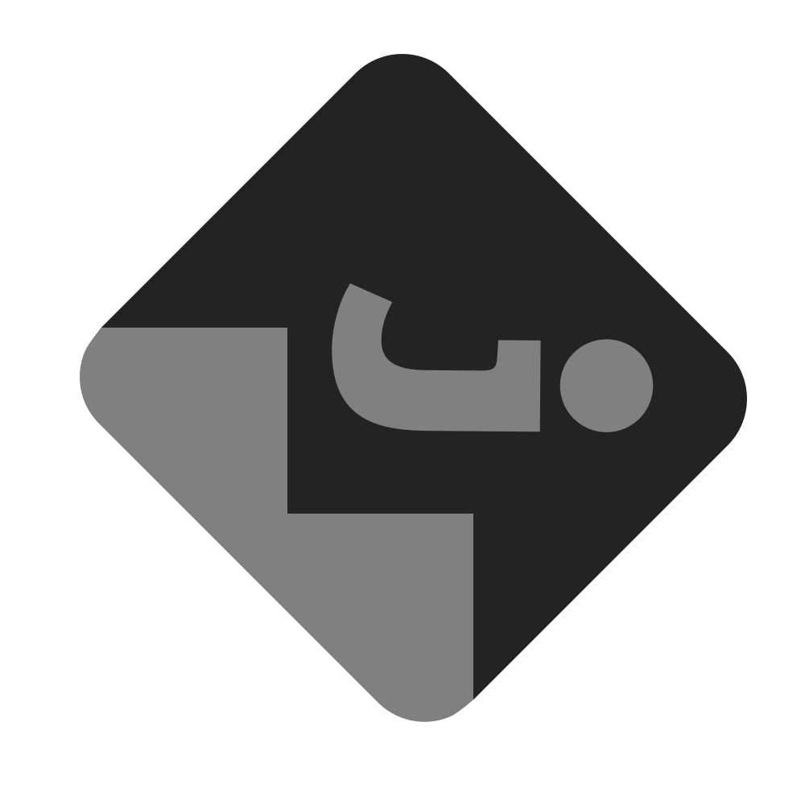

<div align="center">

<br>An app for removing compression and noise from photos<h2></h2>
<table>
<tr>
<td></td>
<td></td>
</tr>
</table>
<p>
<p align="center">
<a href="https://apt.izzysoft.de/fdroid/index/apk/com.je.dejpeg"></a>
<a href="https://codeberg.org/dryerlint/dejpeg/releases/download/latest/dejpeg-arm64-v8a.apk"></a>
<a href="https://apps.obtainium.imranr.dev/redirect?r=obtainium://app/%7B%22id%22%3A%22com.je.dejpeg%22%2C%22url%22%3A%22https%3A%2F%2Fcodeberg.org%2Fdryerlint%2Fdejpeg%22%2C%22author%22%3A%22dryerlint%22%2C%22name%22%3A%22DeJPEG%22%2C%22preferredApkIndex%22%3A0%2C%22overrideSource%22%3A%22Codeberg%22%7D"></a>
</div>

This is not another "AI upscaler" but a compression artifact remover and denoiser using public models such as [FBCNN](https://github.com/jiaxi-jiang/FBCNN) and [SCUNet](https://github.com/cszn/SCUNet)

## features:
- Remove compression artifacts
- Denoise
- Before/after view
- Fully offline

## models:
You can download models [here](models/)

## examples:
Check out [examples](examples/) to get an idea of what DeJPEG can be used for

## limitations:
- Processed locally, a fast device is recommended
- Only standard image formats supported

## versions:
`v3.4.3` was released with seperate builds for descaling, in `v3.5.0` this was changed back to a unified release without compression since better building methods were used and can still fit under the 30mb size requirement. Apologies.

## desktop support:
[chaiNNer](https://github.com/chaiNNer-org/chaiNNer) is a cross-platform image/model utility, which should work well with these models

For FBCNN, which chaiNNer does support but in a limited fashion, install [this custom node](chainner/) and use the [original PyTorch models](https://github.com/jiaxi-jiang/FBCNN/releases/latest), not the mobile onnx.

<details>
<summary><h3>building</h3></summary>

### requirements

standard gradle build process

optional, for descaling: Android NDK, CMake `4.2.3` and ~1GB of free space

or use the helper script:
```bash
./build.sh           # release build for arm64-v8a
./build.sh --debug   # debug build
./build.sh --sign    # signed release build (requires signing config)
./build.sh --help    # show all options
```

Note: when building, it will by default clone [OpenCV](https://github.com/opencv/opencv) and [OpenCV_contrib](https://github.com/opencv/opencv_contrib) to build the library for BRISQUE. If you don't have the NDK or wish to not build this library, download and place the latest [prebuilt APK](https://codeberg.org/dryerlint/dejpeg/releases) (`v3.5.0` or later) into the projects root directory, then run gradle as normal.
</details>

<details>
<summary><h3>credits and license</h3></summary>

### disclaimer:

I am by no means a professional developer and only do this in my spare time, the code is not perfect and quite janky.

This is a GUI for a select amount of `1x` ONNX processing models, used under their respective licenses (Apache 2.0)

You are welcome to embed parts of this app in your own project as long as it remains free as in beer and abides to the GPLv3 license.

  Credits to [@adrianerrea](https://github.com/adrianerrea/fromPytorchtoMobile) for a starting point, [FBCNN](https://github.com/jiaxi-jiang/FBCNN) and [SCUNet](https://github.com/cszn/SCUNet) creators plus all other model owners.

  DeJPEG is not affiliated or related with Topaz `DEJPEG` or any other similarly named software/project. Although I've wondered if the term 'JPEG' is copyrighted/trademarked due to it literally being the acronym for Joint Photographic Experts Group, for this reason I might need to change the app's name if legal issues start to occur.
</details>
