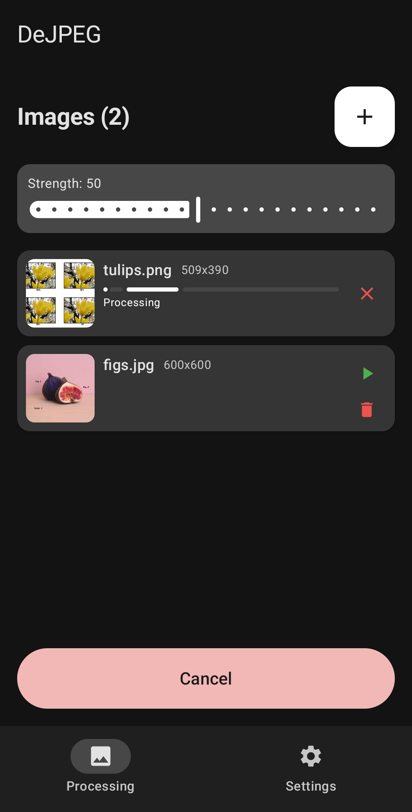
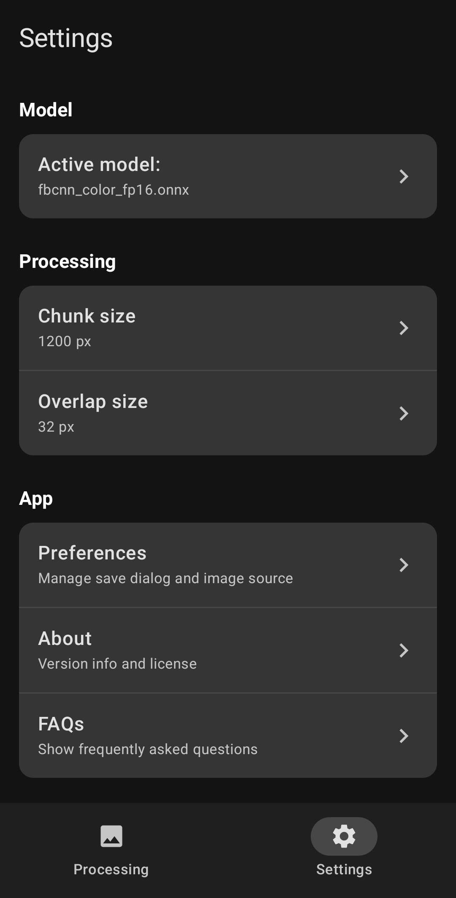

  
   
  An open source app for removing noise and compression from photos
  <h2></h2>
  
  
  
  

  
  
  

  

## features:
- batch processing
- supports most image formats
- before/after view
- custom models
- [fully offline](https://github.com/jeeneo/dejpeg/blob/main/app/src/main/AndroidManifest.xml)

This is not a "super resolution AI upscaler", but simple non-destructive method for cleaning up/restoring images

## models (required):
[FBCNN](https://github.com/jeeneo/FBCNN-mobile/releases/latest) (JPEG compression)

[SCUNet](https://github.com/jeeneo/SCUNet-mobile/releases/latest) (Grain/Noise)

Info [here](https://github.com/jeeneo/dejpeg/wiki/model-types) (also in the apps FAQ)

you can also run other experimental models, more info [here](https://github.com/jeeneo/dejpeg-experimental)

## limitations:
- processed locally, minimum 4gb ram and 4 threads recommended
- very large images might cause crashes

See the [wiki](https://github.com/jeeneo/dejpeg/wiki) for more information

## desktop
The desktop version was deprecated and lacking many features, please use [chaiNNer](https://github.com/chaiNNer-org/chaiNNer)

## note/disclaimer:
De*JPEG* is not affiliated or related with Topaz `DEJPEG` or any other similarly named software/project.

This app stems from personal uses and was modified for public release

## credits:
[@adrianerrea](https://github.com/adrianerrea/fromPytorchtoMobile) for the base application, [FBCNN](https://github.com/jiaxi-jiang/FBCNN) and [SCUNet](https://github.com/cszn/SCUNet) creators plus all other model creators.

This is a GUI wrapper for a select amount of `1x` ONNX image processing models

## license:
All models used are under their respective licenses

You are free to embed parts of this app in your own project as long as it remains free/non-paywalled and must abide to the GPL v3 license