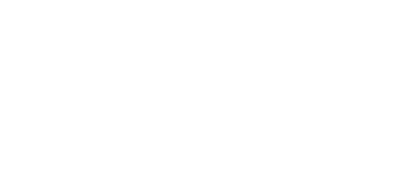

<div align="center">
  
  <br>
  An open source app for removing noise and compression from photos
  <h2></h2>
<table>
<tr>
<td></td>
<td></td>
</tr>
</table>
  <p>
<p align="center">
  <a href="https://apt.izzysoft.de/fdroid/index/apk/com.je.dejpeg"></a>
  <a href="http://apps.obtainium.imranr.dev/redirect.html?r=obtainium://app/%7B%22id%22%3A%22com.je.dejpeg%22%2C%22url%22%3A%22https%3A%2F%2Fgithub.com%2Fjeeneo%2Fdejpeg%22%2C%22author%22%3A%22jeeneo%22%2C%22name%22%3A%22DeJPEG%22%2C%22additionalSettings%22%3A%22%7B%5C%22includePrereleases%5C%22%3Afalse%7D%22%7D"></a>
  </p>
</div>

## features:
- batch processing
- supports most image formats
- before/after view
- [fully offline](/app/src/main/AndroidManifest.xml)
- custom models (beta)
- image descaling (beta)

this is not a "super resolution AI upscaler", but simple non-destructive method for cleaning up/restoring images

## models (required):
download models [here](/models)

## limitations:
- processed locally, minimum 4gb ram and 4 threads recommended
- very large images can cause crashes
- TIFF and other special image formats are not supported.
- GIF animations are not supported but planned.

## other platforms
please use [chaiNNer](https://github.com/chaiNNer-org/chaiNNer) which should work well with these models (regardless if PyTorch or ONNX)

for FBCNN, which chaiNNer does support but in a limited fashion, install [this custom node](chainner/README.md) and use the [original PyTorch models](https://github.com/jiaxi-jiang/FBCNN/releases/latest), not the mobile onnx.

<details>
<summary><h3>building</h3></summary>

this app includes OpenCV with [BRISQUE analysis for descaling an image](), which is experimental but ive occasionally found it useful.

required:
- android NDK 27.3.x
- cmake 3.x or newer
- git
- opencv + contrib

create a directory called `opencv` after cloning dejpeg, then clone opencv + contrib inside that folder
```bash
git clone https://github.com/opencv/opencv.git
git clone https://github.com/opencv/opencv_contrib.git
```
and make a folder called `build_android`

```bash
cd opencv
mkdir build_android && cd build_android
```

structure should be like this

```
$ tree -L 2
...
├── opencv
│   ├── build_android
│   ├── opencv
│   ├── opencv_contrib
...
```

```bash
cmake \
  -DCMAKE_TOOLCHAIN_FILE=$ANDROID_NDK_HOME/build/cmake/android.toolchain.cmake \
  -DANDROID_ABI=arm64-v8a \
  -DANDROID_NATIVE_API_LEVEL=21 \
  -DANDROID_STL=c++_shared \
  -DCMAKE_BUILD_TYPE=MinSizeRel \
  -DCMAKE_CXX_FLAGS_MINSIZEREL="-Os -DNDEBUG -fvisibility=hidden -fvisibility-inlines-hidden -ffunction-sections -fdata-sections" \
  -DCMAKE_C_FLAGS_MINSIZEREL="-Os -DNDEBUG -fvisibility=hidden -fvisibility-inlines-hidden -ffunction-sections -fdata-sections" \
  -DCMAKE_SHARED_LINKER_FLAGS="-Wl,--gc-sections -Wl,-z,max-page-size=16384 -Wl,-z,common-page-size=4096" \
  -DOPENCV_EXTRA_MODULES_PATH=../opencv_contrib/modules \
  -DBUILD_SHARED_LIBS=ON \
  -DBUILD_LIST=core,imgproc,imgcodecs,ml,quality \
  -DBUILD_TESTS=OFF -DBUILD_PERF_TESTS=OFF -DBUILD_ANDROID_EXAMPLES=OFF -DBUILD_DOCS=OFF -DBUILD_EXAMPLES=OFF -DBUILD_PACKAGE=OFF -DBUILD_opencv_java=OFF \
  -DWITH_JPEG=ON -DWITH_PNG=ON -DWITH_TIFF=OFF -DWITH_WEBP=OFF -DWITH_OPENEXR=OFF \
  -DWITH_IPP=OFF -DWITH_EIGEN=OFF -DWITH_LAPACK=OFF -DWITH_TBB=OFF -DWITH_PTHREADS_PF=ON \
  -DWITH_GSTREAMER=OFF -DWITH_V4L=OFF -DWITH_GTK=OFF -DWITH_QT=OFF -DWITH_OPENCL=OFF -DWITH_CUDA=OFF -DWITH_VTK=OFF \
  -DBUILD_PROTOBUF=OFF -DBUILD_TBB=OFF -DBUILD_IPP_IW=OFF -DBUILD_ITT=OFF \
  ../opencv && make -j$(nproc)
```

you can skip stripping and just copy the libs from `lib/arm64-v8a` to there and the next operation will strip them but you'll need to build a `Release` instead of `Debug` (and sign)

copy:
```bash
cp -r lib/arm64-v8a ../../app/src/main/jniLibs && cd ../../app/src/main/jniLibs/arm64-v8a
```

strip debug symbols:

```bash
llvm-strip libopencv_{core,imgproc,ml,imgcodecs,quality}.so
```

build:
```bash
rm app/src/main/jniLibs/arm64-v8a/libbrisque_jni.so
BUILD_BRISQUE_JNI=ON ./gradlew clean assembleDebug
```

note: due to IzzyOnDroid's apk filesize limit to 30mb or less, the native binaries in the official release are compressed using `upx --best --lzma --android-shlib` after being stripped of debug symbols (excluding `libc++_shared.so`). you can skip this step if needed.

compress:
```bash
upx --best --lzma --android-shlib libopencv_{core,imgproc,ml,imgcodecs,quality}.so
```

additionally, i also compress `libonnxruntime.so` with UPX as well (using `upx --ultra-brute --android-shlib`), so to get the original version, extract `libonnxruntime.so` from your compiled version after you've comment out the following config, then extract from the apk, copy to jniLibs, pack using UPX, uncomment and build. this is how i make all releases as to not exceed IzzyOnDroid's 30mb apk size limit but only needs to be done once unless i change something with opencv/brisque.

```kotlin
...
    packaging {
        jniLibs {
            pickFirsts += "lib/*/libonnxruntime.so"
        }
    }
...
```
</details>

<details>
<summary><h3>credits and license</h3></summary>

  [@adrianerrea](https://github.com/adrianerrea/fromPytorchtoMobile) for the base application, [FBCNN](https://github.com/jiaxi-jiang/FBCNN) and [SCUNet](https://github.com/cszn/SCUNet) creators plus all other model owners.

this is a GUI for a select amount of `1x` ONNX processing models. All are used under their respective licenses. You are free to embed parts of this app in your own project as long as it remains free/non-paywalled and must abide to the GPL v3 license

### disclaimer:
De*JPEG* is not affiliated or related with Topaz `DEJPEG` or any other similarly named software/project. although ive wondered if the term 'JPEG' is copyrighted/trademarked due to it literally being the acronym for Joint Photographic Experts Group, for this reason i might need to change the app's name if legal issues start to occur.
</details>
