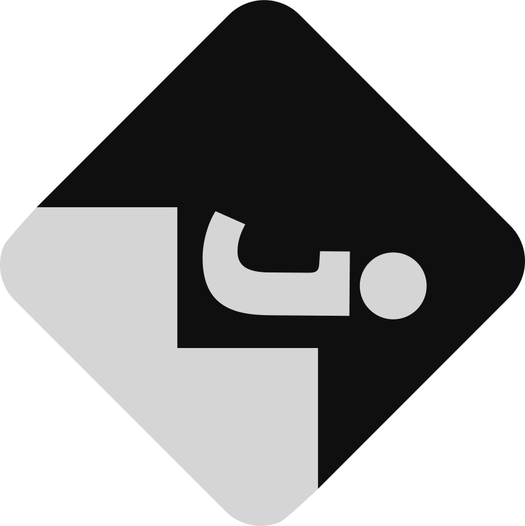
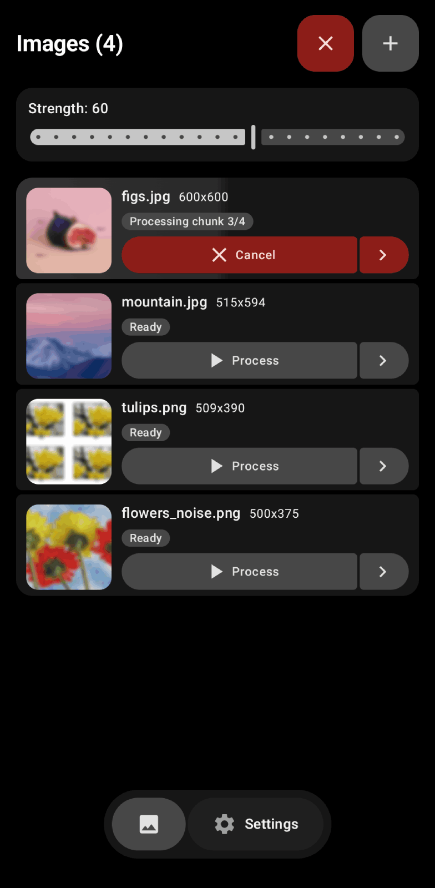
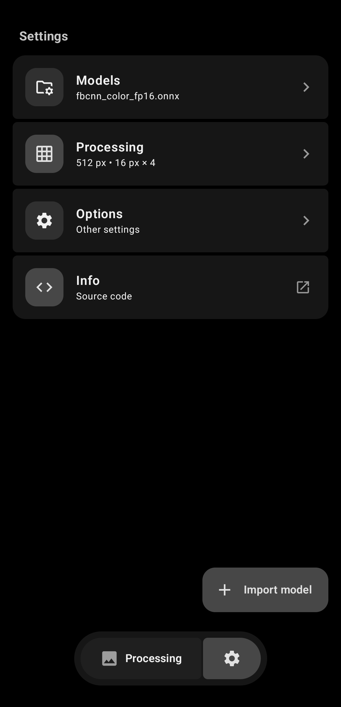
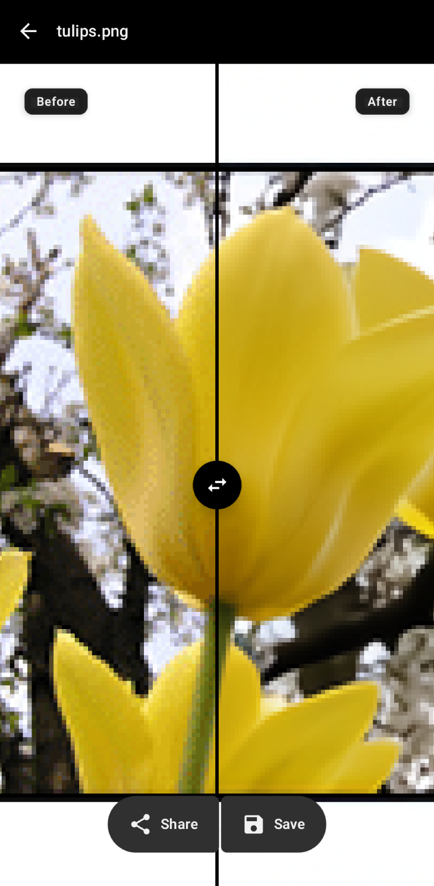
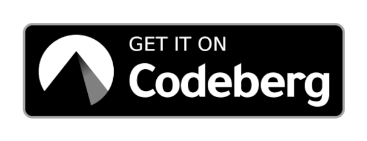
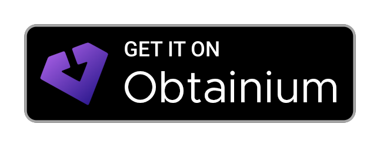

 

 

An offline compression artifact remover and denoise application for Android

[Models list available here](models/), see [examples](examples/) for how to use them.

### Contributing

Translate:
[https://translate.codeberg.org/projects/dejpeg](https://translate.codeberg.org/projects/dejpeg)

### Additional details

If you'd like to use models on PCs (Linux/Mac/Windows), look at [chaiNNer](https://chainner.app/)
(for FBCNN, install this [custom node](chainner/) and use PyTorch models from the [FBCNN repo](https://github.com/jiaxi-jiang/FBCNN))

Regarding the recent restriction of 3rd party apps, this won't be on the Play Store and I will not be involved with [Developer Verification](https://developer.android.com/developer-verification).

<h4>AI transparency</h3>

Previously, the kotlin implementation of brisque was created with the use of LLMs (Generative AI). Due to changes in my personal opinion of Generative AI, I have made the decision to remove this code in its entirety and replace it with the original brisque implementation from OpenCV. Both Oidn and Brisque will be merged into a `native` release with the store release only supporting ONNX.
All future usages of Generative AI will be ceased moving forward. Regarding language translation, I personally want to still use human translation, or classical translation, with LLMs being the last choice.

<h3>building</h3>

Standard gradle build proceses. For building with [Intel® Oidn Denoising](https://www.openimagedenoise.org/) and brisque, see [building.md](building/readme.md)

<h3>credits and license</h3>

This is a GUI for a select amount of `1x` ONNX processing models, used under their respective licenses (Apache 2.0)

DeJPEG v4 and onward is licensed under [AGPLv3-or-later](https://spdx.org/licenses/AGPL-3.0-or-later.html)
Older versions (v3 and under) are under GPLv3-only.

  Credits to [@adrianerrea](https://github.com/adrianerrea/fromPytorchtoMobile) for a starting point, [FBCNN](https://github.com/jiaxi-jiang/FBCNN) and [SCUNet](https://github.com/cszn/SCUNet) creators plus all other model owners.

  DeJPEG is not affiliated or related with Topaz `DEJPEG` or any other similarly named software/project. Although I've wondered if the term 'JPEG' is copyrighted/trademarked due to it literally being the acronym for Joint Photographic Experts Group, for this reason I might need to change the app's name if legal issues start to occur

