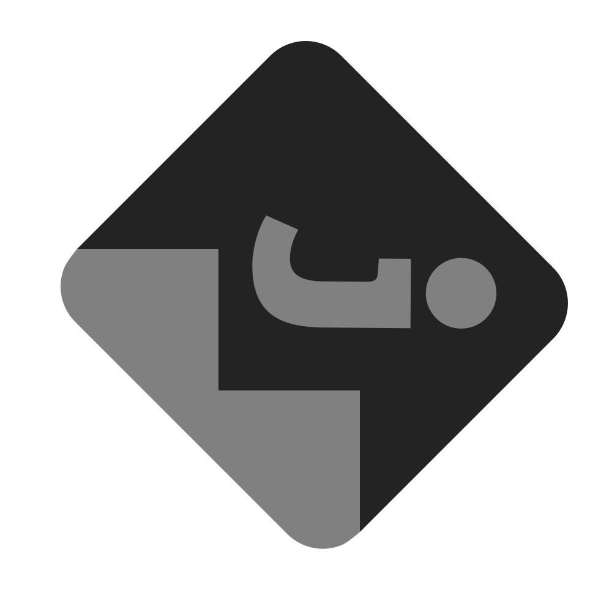

 Removes JPEG artifacts and noise<h2></h2>
<table>
<tr>
<td></td>
<td></td>
</tr>
</table>

## DeJPEG

Removes JPEG artifacts and noise, not an upscaler.

uses:

* FBCNN
* SCUNet
(and others)

---

## Features

* Artifact removal
* Denoise
* Offline

---

## Models

`models/`

---

## Examples

`examples/`

---

## Limits

* Local processing
* Standard image formats only and not huge

---

## Desktop

Can use [chaiNNer](https://chainner.app/)

FBCNN:

* install custom node (`chainner/`)
* use PyTorch models from the [FBCNN repo](https://github.com/jiaxi-jiang/FBCNN) (not ONNX)

---

## Contributing

Translate:
[https://translate.codeberg.org/projects/dejpeg](https://translate.codeberg.org/projects/dejpeg)

## Additional details

For more information please reread

<h3>building</h3>

Standard gradle build proceses

For building with [Intel® Oidn Denoising](https://www.openimagedenoise.org/), see [oidn/readme.md](oidn/readme.md)

<h3>credits and license</h3>

### disclaimer:

hi if you're reading this youre probably not wondering why i changed the readme.

im tired of seeing apps in FOSS stores have these clearly AI written slop/huge readmes so i made the opposite written by an organic intellegence.
i do use some generative ais for the complex parts (eg. getting brisque ported to kotlin and diagnosing oidn to an understandable state) but this isnt vibe slop i made over a weekend, it's human slop created by me and shows my little knowledge about android :D and taken me about 8 months to get to make this human slop. (when i moved to codeberg the repos hostory was historically rewritten (my fault really) T^T)

anyway, i am by no means a professional developer and only do this in my spare time, the code is not perfect and quite janky

This is a GUI for a select amount of `1x` ONNX processing models, used under their respective licenses (Apache 2.0)

You are welcome to embed parts of this app in your own project as long as it remains free as in beer, abides to the GPLv3 license, and credit has been given

  Credits to [@adrianerrea](https://github.com/adrianerrea/fromPytorchtoMobile) for a starting point, [FBCNN](https://github.com/jiaxi-jiang/FBCNN) and [SCUNet](https://github.com/cszn/SCUNet) creators plus all other model owners.

  DeJPEG is not affiliated or related with Topaz `DEJPEG` or any other similarly named software/project. Although I've wondered if the term 'JPEG' is copyrighted/trademarked due to it literally being the acronym for Joint Photographic Experts Group, for this reason I might need to change the app's name if legal issues start to occur.

