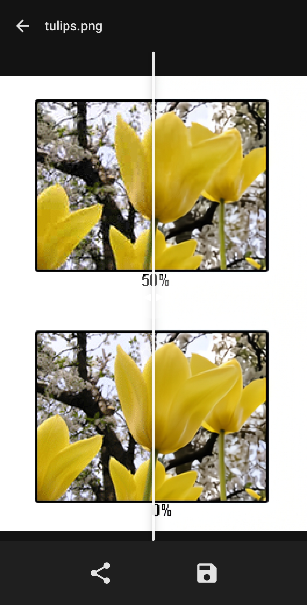

<div align="center">
  
  <br>
  An open source app for removing noise and compression from photos
  <h2></h2>
  
  
  
  <p>
<p align="center">
  <a href="https://apt.izzysoft.de/fdroid/index/apk/com.je.dejpeg"></a>
  <a href="http://apps.obtainium.imranr.dev/redirect.html?r=obtainium://add/https://github.com/jeeneo/dejpeg"></a>
  <a href="https://github.com/jeeneo/dejpeg/releases/latest/download/dejpeg-arm64-v8a.apk"></a>
</p>
  </p>
</div>

## features:
- batch processing
- supports most image formats
- before/after view
- [fully offline](https://github.com/jeeneo/dejpeg/blob/main/app/src/main/AndroidManifest.xml)
- custom models (beta)
- image descaling (beta)

this is not a "super resolution AI upscaler", but simple non-destructive method for cleaning up/restoring images

## models (required):
[FBCNN](https://github.com/jeeneo/FBCNN-mobile/releases/latest) (JPEG artifacts)

[SCUNet](https://github.com/jeeneo/SCUNet-mobile/releases/latest) (noise/grain)

Info [here](https://github.com/jeeneo/dejpeg/wiki/model-types) (see in-app FAQ also)

you can also run other experimental models, more info [here](https://github.com/jeeneo/dejpeg-experimental)

## limitations:
- processed locally, minimum 4gb ram and 4 threads recommended
- very large images can cause crashes
- TIFF and other special image formats are not supported.
- GIF animations are not supported but planned.

See the [wiki](https://github.com/jeeneo/dejpeg/wiki) for more information

## other platforms
please use [chaiNNer](https://github.com/chaiNNer-org/chaiNNer) which should work well with these models (regardless if PyTorch or ONNX)

for FBCNN, which chaiNNer does support but in a limited fashion, install [this custom node](chainner/README.md) and use the [original PyTorch models](https://github.com/jiaxi-jiang/FBCNN/releases/latest), not the mobile onnx.

<details>
<summary><h3>building</h3></summary>

this app includes OpenCV with [BRISQUE analysis for descaling an image](https://github.com/jeeneo/dejpeg/issues/24), which is experimental but ive occasionally found it useful.

required:
- android NDK 27.3.x
- cmake 3.x or newer
- git
- opencv + contrib

create a directory called `opencv` after cloning dejpeg, then clone opencv + contrib inside that folder
```bash
git clone https://github.com/opencv/opencv.git
git clone https://github.com/opencv/opencv_contrib.git
```

structure should be like this

```
$ tree -L 2
...
├── opencv
│   ├── build_android
│   ├── build_android_minimal
│   ├── opencv
│   ├── opencv_contrib
...
```

```bash
cd opencv
mkdir build_android && cd build_android
```

```bash
cmake \
  -DCMAKE_TOOLCHAIN_FILE=$ANDROID_NDK_HOME/build/cmake/android.toolchain.cmake \
  -DANDROID_ABI=arm64-v8a \
  -DANDROID_NATIVE_API_LEVEL=21 \
  -DANDROID_STL=c++_shared \
  -DCMAKE_BUILD_TYPE=MinSizeRel \
  -DCMAKE_CXX_FLAGS_MINSIZEREL="-Os -DNDEBUG -fvisibility=hidden -fvisibility-inlines-hidden -ffunction-sections -fdata-sections" \
  -DCMAKE_C_FLAGS_MINSIZEREL="-Os -DNDEBUG -fvisibility=hidden -fvisibility-inlines-hidden -ffunction-sections -fdata-sections" \
  -DCMAKE_SHARED_LINKER_FLAGS="-Wl,--gc-sections" \
  -DOPENCV_EXTRA_MODULES_PATH=../opencv_contrib/modules \
  -DBUILD_SHARED_LIBS=ON \
  -DBUILD_TESTS=OFF \
  -DBUILD_PERF_TESTS=OFF \
  -DBUILD_ANDROID_EXAMPLES=OFF \
  -DBUILD_DOCS=OFF \
  -DBUILD_opencv_java=OFF \
  -DWITH_GSTREAMER=OFF \
  -DWITH_V4L=OFF \
  -DWITH_GTK=OFF \
  -DWITH_QT=OFF \
  -DWITH_IPP=OFF \
  -DWITH_CUDA=OFF \
  -DWITH_OPENCL=OFF \
  -DWITH_VTK=OFF \
  -DWITH_JASPER=OFF \
  -DWITH_OPENEXR=OFF \
  -DBUILD_EXAMPLES=OFF \
  -DBUILD_PACKAGE=OFF \
  -DBUILD_opencv_core=ON \
  -DBUILD_opencv_imgproc=ON \
  -DBUILD_opencv_ml=ON \
  -DBUILD_opencv_imgcodecs=ON \
  -DBUILD_opencv_quality=ON \
  -DBUILD_opencv_dnn=OFF \
  -DBUILD_opencv_video=OFF \
  -DBUILD_opencv_features2d=OFF \
  -DBUILD_opencv_calib3d=OFF \
  ../opencv && make
```

you can skip stripping and just copy the libs from `lib/arm64-v8a` to there and the next operation will strip them but you'll need to build a `Release` instead of `Debug` (and sign)

strip debug symbols:
```bash
llvm-strip opencv/build_android/lib/arm64-v8a/libopencv_{core,imgproc,ml,imgcodecs,quality}.so
```

copy:
```bash
cp opencv/build_android/lib/arm64-v8a/libopencv_{core,imgproc,ml,imgcodecs,quality}.so ./app/src/main/jniLibs/arm64-v8a/
```

```bash
cd ../../
rm app/src/main/jniLibs/arm64-v8a/libbrisque_jni.so
BUILD_BRISQUE_JNI=ON ./gradlew clean assembleDebug
```

note: the binaries in the official release are compressed using `upx --best --lzma` after being stripped of debug symbols (excluding `libbrisque_jni.so` and `libc++_shared.so`) for IzzyOnDroid's 30mb limit. you can skip with it being ~34mb

</details>

<details>
<summary><h3>credits and license</h3></summary>

  [@adrianerrea](https://github.com/adrianerrea/fromPytorchtoMobile) for the base application, [FBCNN](https://github.com/jiaxi-jiang/FBCNN) and [SCUNet](https://github.com/cszn/SCUNet) creators plus all other model owners.

This is a GUI for a select amount of `1x` ONNX processing models. All are used under their respective licenses. You are free to embed parts of this app in your own project as long as it remains free/non-paywalled and must abide to the GPL v3 license

### disclaimer:
De*JPEG* is not affiliated or related with Topaz `DEJPEG` or any other similarly named software/project.

</details>
