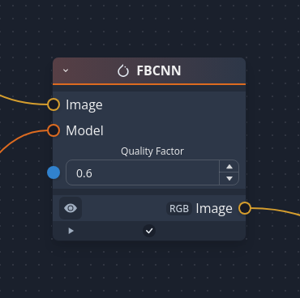

requirements:

- [chaiNNer](https://github.com/chaiNNer-org/chaiNNer) 0.24.x or newer
- the PyTorch dependency installed beforehand

then download and copy [fbcnn_node.py](fbcnn_node.py) to your chaiNNer install under `resources/src/packages/chaiNNer_pytorch/pytorch/restoration`

reopen and the new node should appear under PyTorch > Restoration > FBCNN

