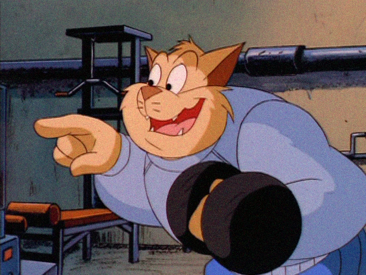
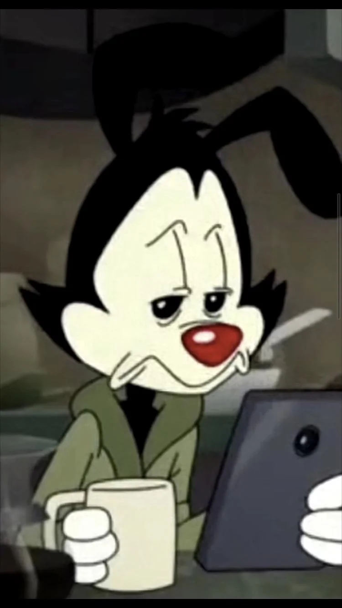
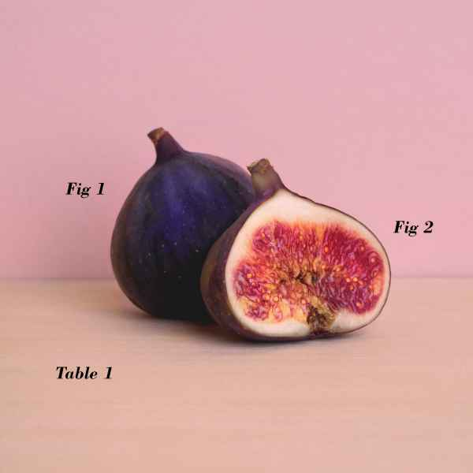
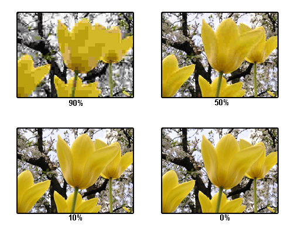
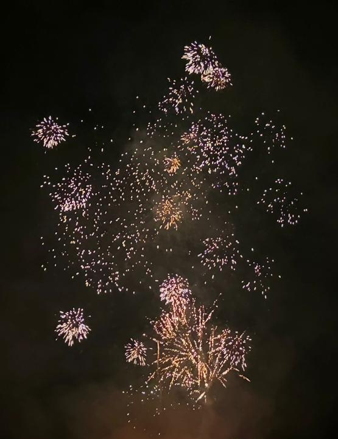
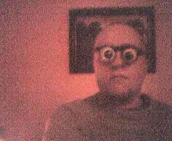
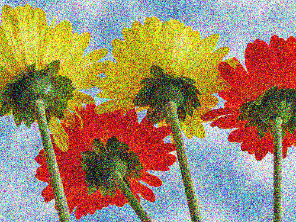
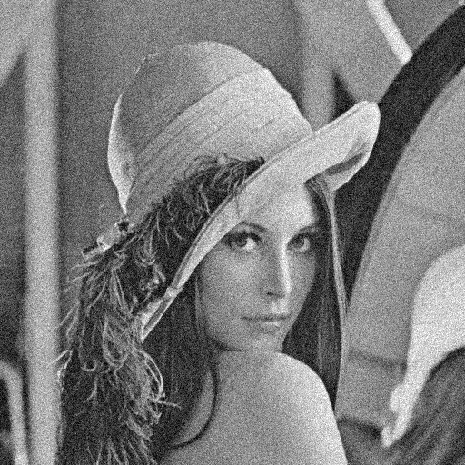
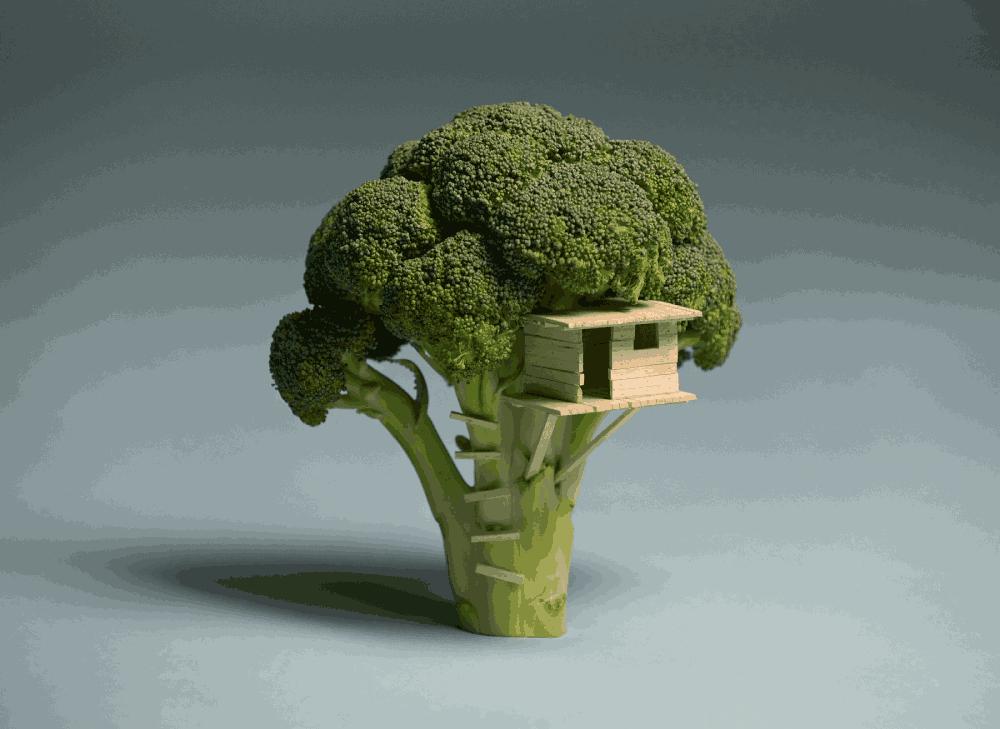

here is are some examples of what DeJPEG can be used for and the model(s) for each type:

models: `1x-span-anime-pretrain`, `1x-RGB-max-Denoise`, `SCUNet`

model: `1x-RGB-max-Denoise`

models: `FBCNN`, `1x-span-anime-pretrain`

model: `SCUNet`

model: `1x_Bandage-Smooth`
